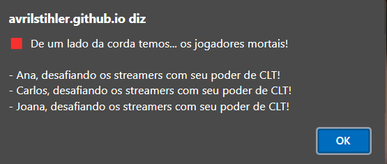
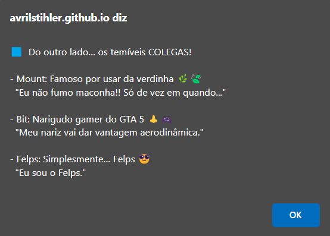
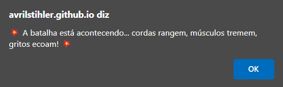
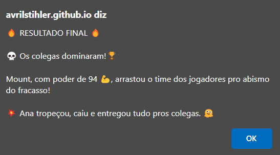

# Batalha Épica: Jogadores vs. Os Colegas

Essa aplicação JavaScript é um mini-jogo interativo onde você forma um time com 3 personagens personalizados para enfrentar um grupo aleatório dos "colegas" da internet em uma disputa de força no Cabo de Guerra.

Clique [aqui](https://avrilstihler.github.io/Cabo-de-Guerra-Streamers/) para acessar o game.

## 🎮 Como funciona

A função `jogar()` executa a lógica principal do jogo. Aqui está um resumo das etapas:

### 🧍‍♂️ Seleção de Jogadores:

- O usuário insere o nome de 3 personagens do seu time.
- Os nomes são validados para conter apenas letras (incluindo acentuação) e no mínimo 2 caracteres.
- Nomes inválidos encerram o jogo com um alerta.

### 🎲 Sorteio dos Colegas:

- O código seleciona aleatoriamente 3 personagens de uma base de dados dos "colegas" da noitada.
- Cada colega possui uma descrição cômica e uma fala característica, dando mais personalidade ao jogo.

### 🎤 Apresentação dos times:

- Um anúncio dramático e teatral apresenta os dois lados:
  - Os **Jogadores mortais**, criados pelo usuário.
  - Os **Colegas streamers**, sorteados aleatoriamente.

### 💪 Força Aleatória:

- Todos os personagens (jogadores e colegas) recebem uma força aleatória entre 1 e 100.
- Essa força define o resultado da batalha.

## ⚔️ Batalha e Resultado:

- As forças dos dois times são somadas e comparadas.
- O time com maior força total vence.
- O mais forte e o azarado de cada time recebem destaque na história.

##  📸 Galeria de Imagens 

Abaixo está um exemplo de uma rodada jogada:

| 🔴 Time dos Jogadores | 🔵 Time dos Colegas |
|---|---|
|  |  |

|  ⚔️ Batalha Acontecendo |🏆 Resultado Final
|---|---|
|  |  |

## Tecnologias utilizadas

- **JavaScript, Html e CSS**
- Funções nativas do navegador:
  - `prompt()` para entrada de nomes
  - `alert()` para narração e resultado
- **Regex** simples para validação de nomes
- **Math.random()** para sorteio e geração da força

